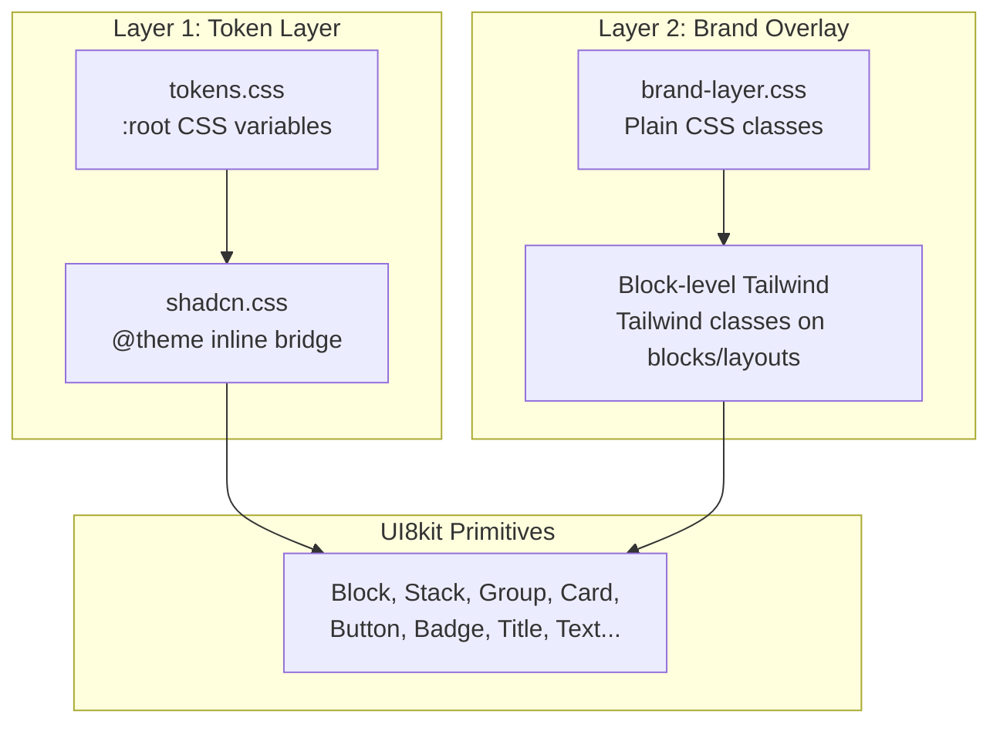

# Cyber OS — Brand Schema + Architecture Plan

## 1. Design Analysis (from example.html)

The reference is Better Stack's AI SRE landing — a **dark-first tech product** with these distinctive traits:

- **Background:** Deep navy `#0B0C14` (hsl ~230 30% 6%)
- **Accent:** Indigo/violet `#7C87F7` (hsl ~233 88% 73%)
- **Text:** Light neutral `#C9D3EE` for body, white for emphasis
- **Cards:** `#0F101A` with `border-[#727DA1]/10` — subtle glass panels
- **Buttons:** Gradient CTA (`bg-button-gradient`), ghost with blur
- **Typography:** Helvetica/sans-serif, tight leading `108%` for headings, `145%` for body
- **Effects:** `backdrop-blur-2xl`, gradient text (`logs-text text-transparent`), gradient borders (`border-separator-gradient`), AOS fade animations
- **Layout:** Large sections with alternating image+text, full-width hero, 950px content max
- **Shape:** `rounded-xl` cards, `rounded-lg` menus, sharp separators
- **Compact nav controls:** `h-[27px]`, `text-[13px]`, `leading-[100%]`, `px-2`, `rounded` (not `rounded-lg`) — significantly smaller than standard button sizes. Sign in is ghost (`hover:text-white`), Sign up is gradient solid. Nav bar is only `h-[52px]`.
- **Dropdown panels (glass floating):** `bg-[#181926]/80`, `backdrop-blur-2xl`, `border-[#1F2433]/75`, `rounded-lg`, `p-[6px]` — not standard Card, a distinct floating glass panel with blur and semi-transparent bg. Menu items: `py-[10px]`, `hover:bg-[#727DA1]/15`, `rounded`, `leading-[145%]`.
- **Feature cards with image overlay:** `bg-[#0F101A]`, `border-[#727DA1]/10`, `rounded-xl`, fixed `h-[350px]`, background image `absolute inset-0`, content anchored bottom via `flex flex-col justify-end`, `p-7.5`. Text sits on image with implied gradient overlay.
- **Footer micro-text layer:** `text-[12px]`, `leading-[18px]`, legal links in `text-neutral-300`, `gap-6` spacing, separated by `border-t border-neutral-300/10`.

## 2. Create Schema via CLI

```bash
npx brand-os init \
  --name "Cyber OS" \
  --description "Central data hub with CRUD admin, design tokens showcase, and multi-surface component library" \
  --style bold \
  --palette violet \
  --surfaces landing,dashboard,docs,admin \
  --out ".project/Cyber Brand OS/cyber-os.schema.json" \
  --json
```

Then **enrich the schema** with:

- Dark-first color tokens matching the `#0B0C14` / `#7C87F7` palette (both light and dark modes)
- Extended color roles: `surface-elevated`, `surface-subtle`, `surface-strong`, `overlay-soft`, `overlay-strong` (from [tokens.css](template-tech-blog/src/assets/css/shared/tokens.css))
- Typography: `Geist` or `Inter` for UI, `JetBrains Mono` for code/data, display sans for headings
- Extended typography scale: `--text-2xs: 12px` (footer legal), `--text-xs: 13px` (nav), `--text-sm: 14px`, `--text-base: 16px`, `--text-md: 18px`, `--text-lg: 20px`, plus display sizes `28px`, `40px`, `53px` for headings
- Leading scale: `--leading-tight: 108%` (hero headings), `--leading-snug: 120%` (h1), `--leading-normal: 145%` (body), `--leading-flat: 100%` (nav)
- Radius: sharp-to-moderate scale (`0`, `0.25rem`, `0.5rem`, `0.75rem`, `1rem`)
- Shadow: soft glass-style shadows (`0 4px 20px -4px hsl(shadow-soft / 0.10)`)
- Motion: `backdrop-blur`, gradient text, stagger animations, `cubic-bezier(0.4, 0, 0.2, 1)` easing
- Section archetypes tailored to data hub: hero, stats-overview, data-table, crud-form, token-showcase, component-gallery
- Component policy: keep UI8kit primitives standard, wrap Card/Button/Badge with brand layer

## 3. Two-Layer Architecture




### Layer 1: Token Layer (managed by schema, controls primitives)

Files: `tokens.css` + `shadcn.css`

- All semantic colors as CSS custom properties (`--background`, `--primary`, `--accent`, etc.)
- Extended domain colors: `--surface-elevated`, `--overlay-soft`, `--chart-1..5`, `--category-1..7`
- Font families, radius scale, shadow presets
- Dark mode toggle via `.dark` class on root
- `shadcn.css` imports `tokens.css` and bridges to Tailwind 4 `@theme inline`
- **This layer controls how UI8kit primitives look** — Button `variant="primary"` uses `--primary`, Card uses `--card`, etc.

### Layer 2: Brand Overlay (blocks and layouts)

Files: `brand-layer.css` + Tailwind classes directly on blocks

- `brand-layer.css` — reusable CSS classes for effects that tokens alone cannot express:
  - `.cyber-gradient-text` — gradient text effect (like `logs-text text-transparent`)
  - `.cyber-glass-card` — backdrop-blur + semi-transparent bg + subtle border
  - `.cyber-glass-panel` — floating dropdown/popover: `bg-[#181926]/80`, `backdrop-blur-2xl`, `border-[#1F2433]/75`, `rounded-lg`
  - `.cyber-glass-panel-item` — menu item inside glass panel: `hover:bg-[#727DA1]/15`, `rounded`, `py-[10px]`, `leading-[145%]`
  - `.cyber-nav-blur` — fixed nav with blur background, `h-[52px]`, `border-b border-[#727DA1]/15`
  - `.cyber-nav-btn` — compact nav button: `h-[27px]`, `text-[13px]`, `leading-[100%]`, `px-2`, `rounded`
  - `.cyber-nav-btn-ghost` — ghost variant: transparent bg, `hover:text-white`, `transition`
  - `.cyber-nav-btn-solid` — gradient CTA variant: `bg-button-gradient`, `text-white`, `font-medium`
  - `.cyber-separator` — gradient border separators (`border-image-t border-separator-gradient`)
  - `.cyber-cta-gradient` — button gradient background for large CTAs
  - `.cyber-feature-card` — image overlay card: `bg-[#0F101A]`, `border-[#727DA1]/10`, `rounded-xl`, `h-[350px]`, `overflow-hidden`, content flex-end
  - `.cyber-feature-card-overlay` — image positioned `absolute inset-0` with implied gradient bottom overlay
  - `.cyber-footer-legal` — micro-text: `text-[12px]`, `leading-[18px]`, muted color, `gap-6`
  - `.animate-`* and `.stagger-`* — entrance animations (fadeIn, slideUp, slideDown, scaleIn)
  - `.card-hover` — scale(1.02) + elevated shadow on hover with 0.6s ease
- Block-level Tailwind classes — `bg-[#0B0C14]`, `border-[#727DA1]/10`, `backdrop-blur-2xl` applied directly on `Block`, `Stack`, `Group` components via their semantic props or via `data-class` targeting

### What goes where — decision rule


| Need                                  | Layer          | Example                                  |
| ------------------------------------- | -------------- | ---------------------------------------- |
| Semantic color used by primitive      | Token          | `--primary: hsl(233 88% 73%)`            |
| Radius, shadow, font family           | Token          | `--radius-xl: 1rem`                      |
| Dark mode color switch                | Token          | `.dark { --background: ... }`            |
| Compact nav typography                | Token          | `--text-xs: 13px`, `--leading-flat`      |
| Footer legal micro-text               | Token          | `--text-2xs: 12px`                       |
| Gradient text effect                  | Brand CSS      | `.cyber-gradient-text`                   |
| Glass card blur + semi-transparent bg | Brand CSS      | `.cyber-glass-card`                      |
| Floating glass dropdown               | Brand CSS      | `.cyber-glass-panel`                     |
| Compact nav buttons (27px)            | Brand CSS      | `.cyber-nav-btn`, `.cyber-nav-btn-solid` |
| Feature card with image overlay       | Brand CSS      | `.cyber-feature-card`                    |
| Footer legal text style               | Brand CSS      | `.cyber-footer-legal`                    |
| Section padding, max-width, layout    | Block Tailwind | `py="32" max="w-6xl"`                    |
| One-off positioning                   | Block Tailwind | `absolute="" top="0"`                    |


## 4. File Structure (inside the generated project)

```
src/
├── assets/css/
│   ├── shared/
│   │   └── tokens.css          <-- Layer 1: all CSS custom properties
│   ├── shadcn.css              <-- Layer 1: @theme inline bridge
│   └── brand-layer.css         <-- Layer 2: cyber-specific CSS classes
├── components/                 <-- UI8kit primitives (auto-installed)
├── variants/                   <-- CVA configs (auto-installed)
├── lib/                        <-- utility-props (auto-installed)
├── blocks/                     <-- Page sections and page views
├── layouts/                    <-- MainLayout, AdminLayout, DocsLayout
├── partials/                   <-- Header, Footer, Sidebar, ThemeToggle
├── routes/                     <-- Page routes
├── data/                       <-- context.ts, fixtures
└── App.tsx
```

## 5. Block Inventory (all surfaces)

### Landing Page (`LandingPageView`)

- `HeroBlock` — gradient text title, subtitle, email signup CTA, hero illustration
- `LogoBannerBlock` — scrolling customer logos strip
- `FeatureSplitBlock` — alternating image+text sections (like AI SRE feature sections)
- `FeatureCardGridBlock` — 2x2 or 3-col grid of glass cards with icons
- `TestimonialsBlock` — quote cards or logo wall
- `PricingBlock` — pricing comparison cards
- `CtaBlock` — final conversion section with gradient CTA
- `FooterBlock` — multi-column links footer

### Dashboard (`DashboardPageView`)

- `StatsOverviewBlock` — 4-col metric cards (value, label, trend)
- `ChartBlock` — chart area (placeholder for chart lib)
- `RecentActivityBlock` — activity feed/timeline
- `QuickActionsBlock` — shortcut button grid

### Admin / CRUD (`AdminPageView`)

- `DataTableBlock` — sortable, filterable table with pagination
- `CrudFormBlock` — form for creating/editing JSON data
- `JsonEditorBlock` — code editor panel for raw JSON
- `DetailPanelBlock` — side panel showing record details
- `AdminSidebarBlock` — left sidebar with nav links, collections list

### Docs / Design Tokens (`DocsPageView`)

- `TokenShowcaseBlock` — color swatches, typography samples, spacing scale
- `ComponentGalleryBlock` — live examples of all UI8kit primitives with variants
- `CardVariantsBlock` — card style gallery
- `ButtonVariantsBlock` — all button sizes/variants
- `BadgeVariantsBlock` — badge gallery
- `TypographyBlock` — heading + body text specimens
- `IconGalleryBlock` — icon grid

### Auth (`AuthPageView`)

- `LoginBlock` — centered login form (email + password)
- `RegisterBlock` — registration form
- `ForgotPasswordBlock` — password reset

### Shared Partials

- `CyberHeader` — fixed `h-[52px]` nav with `.cyber-nav-blur`, logo, nav links (`text-[13px]`), dropdown `.cyber-glass-panel` menus, ghost sign-in + gradient sign-up (`.cyber-nav-btn-solid`, `h-[27px]`)
- `CyberFooter` — multi-column links footer + `.cyber-footer-legal` bottom bar (`text-[12px]`, terms/privacy/gdpr links)
- `CyberSidebar` — collapsible left sidebar for admin/docs
- `ThemeToggle` — dark/light switch
- `Breadcrumbs` — navigation breadcrumb

### Shared Layouts

- `MainLayout` — header + main + footer (for landing, public pages)
- `AdminLayout` — sidebar + topbar + main content (for admin, CRUD)
- `DocsLayout` — sidebar + content + optional TOC (for docs, tokens)

## 6. Execution Steps

### Step 1: Generate schema via CLI

Run `brand-os init` with `--style bold --palette violet`, then manually enrich the generated `cyber-os.schema.json` with the exact Better Stack palette, extended color roles, and all surface/section archetypes.

### Step 2: Emit artifacts

Run `brand-os --schema ... --bootstrap` to generate prompt pack, parser contract, and `brand-brief.md`.

### Step 3: Create tokens.css

Write the token file with both light and dark mode variables, matching the enriched schema. Include extended tokens: `surface-elevated`, `surface-subtle`, `overlay-soft`, `chart-*`, `category-*`.

### Step 4: Create shadcn.css bridge

Bridge tokens to Tailwind 4 `@theme inline`, mapping all CSS variables to Tailwind color/font/radius/shadow utilities.

### Step 5: Create brand-layer.css

Define cyber-specific CSS classes: gradient text, glass cards, nav blur, separators, CTA gradients, animations, hover effects.

### Step 6: Build blocks (separate session)

Using the brand-brief.md + surface prompts as constraints, build each block from the inventory above using UI8kit primitives + brand overlay classes.